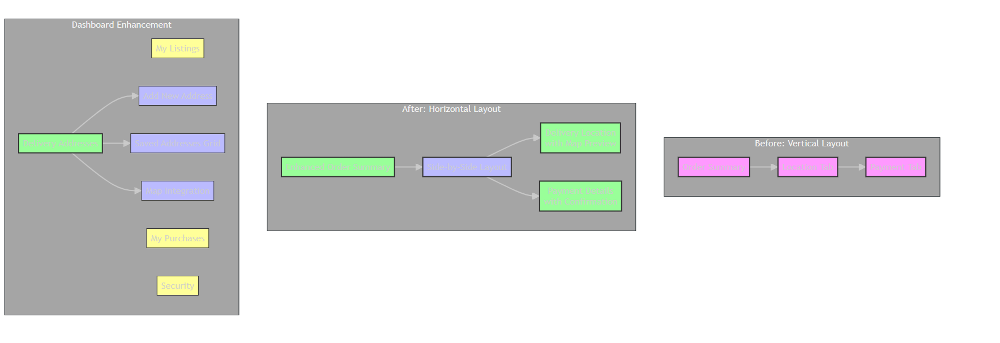

# EcoFinds: A Sustainable E-Commerce Marketplace

Welcome to the official repository for EcoFinds, a full-stack e-commerce web application built from the ground up. This platform is designed as a marketplace for users to buy and sell sustainable, eco-friendly products, promoting a community of conscious consumerism.

This project was built to demonstrate a complete development lifecycle, from setting up a custom backend and database to integrating it with a modern React frontend.

## System Architecture



The above diagram illustrates the complete system architecture, showing the flow of data between the frontend React application, backend Express.js API, and PostgreSQL database with Docker containerization.

## Key Features

*   **Complete User Authentication**: Secure user registration and login functionality using JWT (JSON Web Tokens).
*   **Product Listings**: Users can create, read, update, and delete their own product listings.
*   **Product Discovery**: Browse a full catalog of products with support for searching by keyword and filtering by category.
*   **Shopping Cart**: A fully functional shopping cart where users can add, view, and remove items with proper image display.
*   **Order Management**: A simulated checkout process that converts a user's cart into a persistent order.
*   **User Dashboard**: A personalized dashboard where users can view their product listings and review their purchase history.
*   **Relational Database**: Built on a robust PostgreSQL database with a well-defined, relational schema.
*   **Secure Image Uploads**: Users can upload multiple images for their products, which are stored securely as binary data directly in the PostgreSQL database.
*   **Advanced Security**:
    *   **Forgot Password**: A complete password reset flow via secure, one-time email links.
    *   **Two-Factor Authentication (2FA)**: Users can enable email-based OTPs for an extra layer of security upon login.
*   **Detailed Product Information**: Products can be listed with extensive details, including condition, brand, model, dimensions, materials, and more.
*   **Dynamic Image Gallery**: A responsive, Amazon-style image gallery on the product detail page with thumbnail navigation.
*   **Enhanced Image Handling**: 
    *   **Dual Image Support**: Supports both external URL-based images (for seeded data) and blob-stored images (for user uploads).
    *   **Image API**: Robust image serving API that handles redirects for external images and blob serving for uploaded images.
    *   **Cart Image Display**: Fixed cart functionality to properly display product images with fallback handling.
*   **Modern UI Components**: Built with shadcn/ui components and Tailwind CSS for a professional, responsive design.
*   **Email Integration**: Complete email system for password resets, 2FA codes, and payment confirmations.
*   **Location Services**: Delivery location picker for order processing.

## Technology Stack

The entire application is built with modern, widely-used technologies, avoiding any BaaS (Backend as a Service) platforms like Firebase or Supabase.

### Backend

*   **Runtime**: Node.js
*   **Framework**: Express.js
*   **Database**: PostgreSQL
*   **ORM**: Prisma
*   **Authentication**: JSON Web Tokens (JWT)
*   **Validation**: Zod for schema-based validation
*   **Language**: TypeScript

### Frontend

*   **Framework**: React
*   **Build Tool**: Vite
*   **Language**: TypeScript
*   **Styling**: Tailwind CSS with shadcn/ui components
*   **Routing**: React Router DOM
*   **API Communication**: Axios

---

## Getting Started

Follow these instructions to get the entire application running on your local machine for development and testing purposes.

### Prerequisites

*   **Node.js**: Make sure you have Node.js (version 16 or later) installed.
*   **Docker Desktop**: You must have Docker Desktop installed and running to manage the local PostgreSQL database.

### 1. Backend Setup

First, set up and start the backend server.

```bash
# 1. Navigate into the backend directory
cd backend

# 2. Install all required dependencies
npm install

# 3. Start the PostgreSQL database using Docker
# This will start a container in the background.
docker-compose up -d

# 4. Set up the database tables and seed them with sample data
# This command wipes the database, applies migrations, and runs the seed script.
npx prisma migrate reset --force

# 5. Start the backend server
# The API will now be running at http://localhost:5000
npm run dev
```
**Important:** You must leave the terminal from Step 5 running. This process is your live backend server.

### 2. Frontend Setup

Now, in a **new, separate terminal window**, set up and start the frontend application.

```bash
# 1. Navigate to the project's root directory
# (If you are in the 'backend' directory, go back one level)
cd ..

# 2. Install all required dependencies
npm install

# 3. Start the frontend development server
# The application will now be running, likely at http://localhost:8080
npm run dev
```
You can now open your browser to the local URL provided by Vite to use the application.

---

## Project Structure

### Backend (`/backend`)

```
/backend
├── prisma/
│   ├── migrations/         # Database migration files
│   ├── schema.prisma       # The heart of the database schema
│   └── seed.ts             # Script for seeding sample data
├── src/
│   ├── api/                # Main folder for all API route logic
│   │   ├── auth/           # Authentication routes, controllers, services
│   │   ├── products/       # Product-related routes, controllers, services
│   │   ├── cart/           # Cart-related routes, controllers, services
│   │   └── orders/         # Order-related routes, controllers, services
│   ├── middleware/
│   │   └── auth.middleware.ts # Middleware for protecting routes
│   ├── utils/
│   │   ├── jwt.ts          # Utility for handling JWTs
│   │   └── password.ts     # Utility for hashing passwords
│   ├── app.ts              # Express app configuration
│   └── index.ts            # Server entry point
├── .env                    # Environment variables (DB URL, JWT Secret)
└── docker-compose.yml      # Docker configuration for PostgreSQL
```

### Frontend (`/src`)

```
/src
├── components/
│   ├── ui/                 # Reusable UI components from shadcn/ui
│   ├── Navigation.tsx      # The main navigation bar
│   ├── ProductCard.tsx     # The card for displaying a single product
│   └── ProtectedRoute.tsx  # Component to protect routes from unauth'd users
├── contexts/
│   └── AuthContext.tsx     # Global state management for authentication
├── lib/
│   ├── api.ts              # Centralized Axios instance for API calls
│   └── utils.ts            # General utility functions
├── pages/
│   ├── Landing.tsx         # The main product discovery page
│   ├── ProductDetail.tsx   # The page for a single product
│   ├── Auth.tsx            # The login/signup page
│   ├── Dashboard.tsx       # The user's personalized dashboard
│   ├── Cart.tsx            # The shopping cart page
│   └── AddProduct.tsx      # The form for creating a new product
├── App.tsx                 # Main app component with routing setup
└── main.tsx                # Frontend entry point
```

---

## API Endpoint Reference

The base URL for all API endpoints is `http://localhost:5000/api`.

| Method | Endpoint             | Protection | Description                                           |
|--------|----------------------|------------|-------------------------------------------------------|
| `POST` | `/auth/register`     | None       | Creates a new user and returns a JWT.                 |
| `POST` | `/auth/login`        | None       | Logs in a user and returns a JWT.                     |
| `GET`  | `/auth/me`           | **Protected**  | Gets the profile of the currently logged-in user.     |
| `POST` | `/auth/forgot-password` | None      | Sends a password reset email to the user.             |
| `POST` | `/auth/reset-password`  | None      | Resets the user's password using a valid token.       |
| `POST` | `/auth/verify-otp`      | **Protected** | Verifies the 2FA one-time password.                 |
| `POST` | `/auth/2fa/status`      | **Protected** | Enables or disables two-factor authentication.        |
| `GET`  | `/products`          | None       | Gets all products. Supports `?search` and `?category`.|
| `GET`  | `/products/:id`      | None       | Gets a single product by its ID.                      |
| `POST` | `/products`          | **Protected**  | Creates a new product.                                |
| `PUT`  | `/products/:id`      | **Protected**  | Updates a product owned by the user.                  |
| `DELETE`| `/products/:id`      | **Protected**  | Deletes a product owned by the user.                  |
| `GET`  | `/cart`              | **Protected**  | Gets all items in the user's cart.                    |
| `POST` | `/cart`              | **Protected**  | Adds an item to the cart or updates its quantity.     |
| `DELETE`| `/cart/:productId`   | **Protected**  | Removes an item from the cart.                        |
| `GET`  | `/orders/history`    | **Protected**  | Gets the user's purchase history.                     |
| `POST` | `/orders/checkout`   | **Protected**  | Creates an order from the user's cart and clears it.  |
| `GET`  | `/categories`        | None       | Gets a list of all product categories.                |
| `GET`  | `/images/:id`        | None       | Serves images from the database (redirects for external URLs, serves blobs for uploaded images). |

---

## Recent Improvements & Bug Fixes

### Cart Image Display Fix (Latest Update)

**Issue**: Product images were not displaying in the shopping cart, showing "No image" placeholders instead.

**Root Causes Identified**:
1. **Backend Cart Service**: The cart API wasn't including product images in the response
2. **Image API Route**: The image serving endpoint couldn't handle both external URLs (seeded images) and blob data (uploaded images)
3. **Frontend Image Handling**: Cart component wasn't using the same robust image handling as other components

**Solutions Implemented**:
1. **Enhanced Cart Service**: Updated `getCart` function to include product images with proper relations
2. **Improved Image API**: Modified `/api/images/:id` endpoint to handle both image types:
   - External URLs: Redirects to the original image source
   - Blob Data: Serves binary image data with proper MIME types
3. **Frontend Improvements**: 
   - Updated cart component to use `ImageWithFade` component for consistent image handling
   - Added comprehensive error logging for debugging image loading issues
   - Improved fallback handling for products without images

**Technical Details**:
- Cart now receives products with full image arrays instead of single image URLs
- Image API supports both seeded products (with external URLs) and user-uploaded products (with blob storage)
- Added proper error handling and debugging capabilities for image loading
